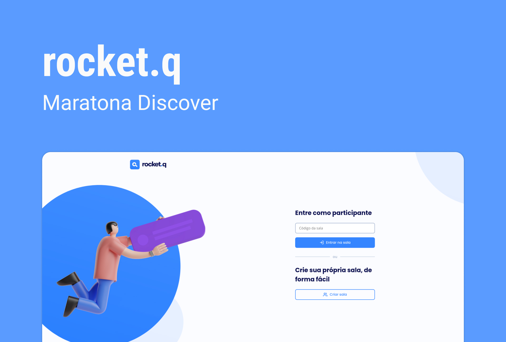

  

  <table>
    <td>
      <a href="#project">Projeto</a>
    </td>
    <td>
      <a href="#layout">Layout</a>
    </td>
    <td>
      <a href="#techs">Tecnologias</a>
    </td>
    <td>
      <a href="#license">Licença</a>
    </td>
  </table>

  

<h2 id="project">📖 <b>Projeto</b></h2>

  O rocket.q é uma aplicação direcionada à perguntas anônimas, onde um usuário cria uma sala e compartilha o código da sala para que sejam feitas perguntas de maneira anônima, o administrador da sala pode marcar as perguntas como lida ou excluí-las passando a senha usada na criação da sala.

 
<h2 id="layout">🎨 <b>Layout</b></h2>

  O layout do projeto pode ser visualizado através <a href="https://www.figma.com/file/vp3iFfd1ohCbHyDX9jCiQi/Roquet.q-02?node-id=0%3A1">desse link</a>.

 
<h2 id="techs">💻 <b>Tecnologias</b></h2>
  <ul>
    <li>HTML</li>
    <li>CSS</li>
    <li>JavaScript</li>
    <li>NodeJS</li>
    <li>EJS</li>
    <li>Express</li>
    <li>SQLite</li>
  </ul>
 
<h2 id="license">📝 <b>Licença</b></h2>

  Esse projeto está sob alicença MIT. Veja o arquivo <a href=".github/LICENSE.md">LICENSE</a> para mais detalhes.

 

